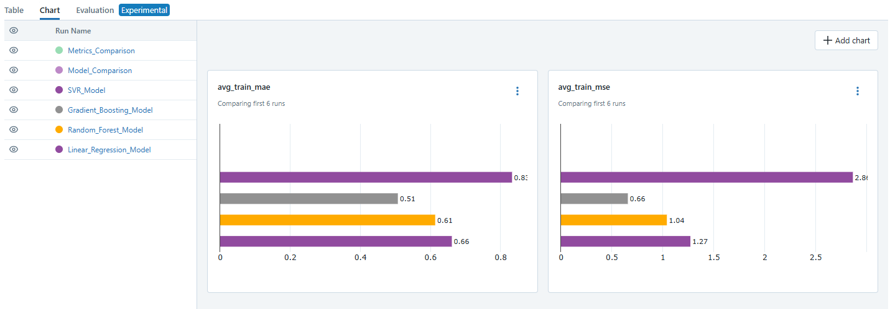
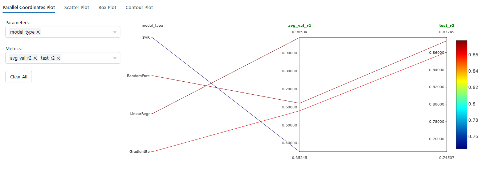
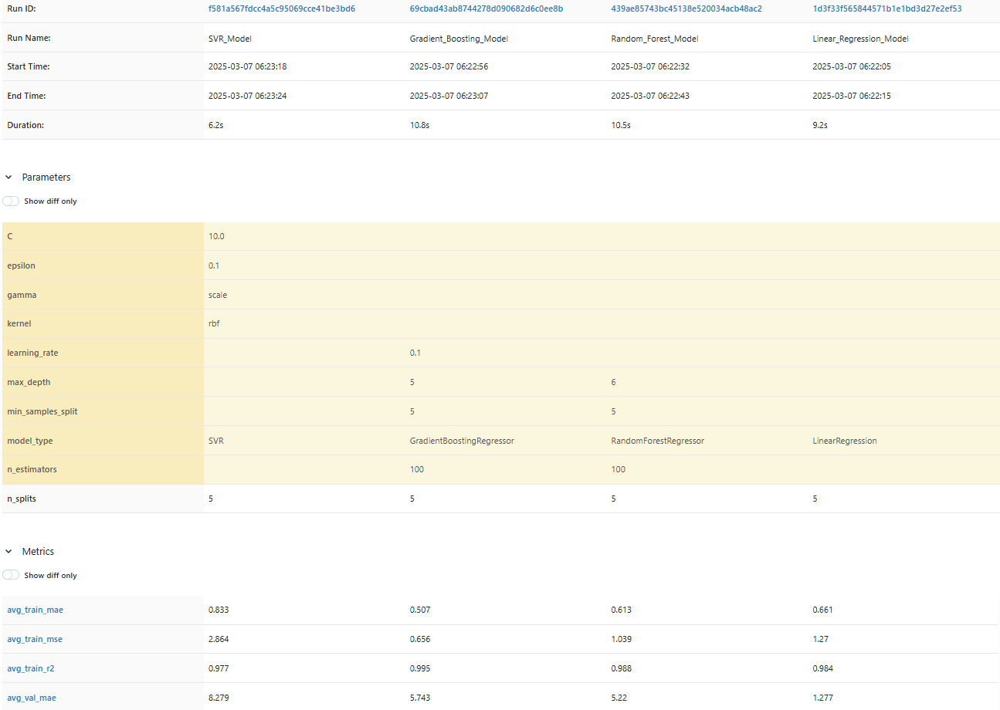

# Evaluación de Modelos ML con MLflow

Este proyecto implementa el entrenamiento y evaluación de modelos de Machine Learning supervisados utilizando MLflow para el seguimiento de experimentos.

## Descripción

El proyecto utiliza el dataset "daily-oil-prices" para predecir el precio del petróleo basado en características derivadas de datos históricos. El dataset contiene información sobre precios diarios de petróleo desde el 20/05/1987 hasta el 21/01/2025. 

Se implementan y comparan dos modelos:
1. Regresión Lineal (como baseline)
2. Random Forest Regressor

## Dataset

El dataset "daily-oil-prices" contiene:
- Fuente: Hugging Face (harishb00/daily-oil-prices)
- Formato: Archivo parquet
- Columnas principales: 
  - Date: Fecha del registro (convertida a datetime)
  - Price: Precio del petróleo (variable objetivo)
- Características derivadas: Año, mes, día, día de la semana, trimestre, precios con rezago, promedios móviles

## Estructura del Proyecto

```
MLEvaluacion/
│
├── data/                        # Directorio para almacenar los datos
│   ├── raw/                     # Datos sin procesar (oil_prices.parquet)
│
├── notebooks/                   # Notebooks de Jupyter
│   └── oil_prices_mlflow.ipynb  # El notebook principal con el código
│
├── models/                      # Modelos entrenados
│
├── mlruns/                      # Directorio donde MLflow guarda sus datos
│
├── reports/                     # Informes y visualizaciones
│   └── figures/                 # Gráficas generadas
│
├── predict_prices.py            # Script simplificado para cargar y usar el modelo entrenado y evaluado
├── docker-compose.yml           # facilita la ejecución del contenedor y la gestión de volúmenes
├── Dockerfile                   # Configura un entorno basado en Python 3.11 con todas las dependencias necesarias para el proyecto
├── .gitignore                   # Archivos a ignorar por git
├── README.md                    # Esta documentación
└── requirements.txt             # Dependencias del proyecto
```

## Requisitos

Las dependencias del proyecto se encuentran en el archivo `requirements.txt`. Para instalarlas:

```bash
pip install -r requirements.txt
```
```bash
pandas==2.0.3       # Manipulación y análisis de datos tabulares
numpy==1.24.3        # Computación numérica eficiente
matplotlib==3.7.2   # Visualización de datos básica
seaborn==0.12.2      # Visualización de datos estadística avanzada
scikit-learn==1.3.0  # Aprendizaje automático y modelado predictivo
mlflow==2.8.1        # Seguimiento y gestión de experimentos de ML
pyarrow==14.0.1      # Manejo eficiente de datos en memoria y entre sistemas
requests==2.31.0     # Solicitudes HTTP para APIs web
ipykernel==6.25.0    # Núcleo de IPython para Jupyter
jupyterlab==4.0.5    # Entorno de desarrollo interactivo basado en web
notebook==7.0.3      # Interfaz de usuario basada en web para cuadernos Jupyter
```

## Preprocesamiento de Datos

El proyecto incluye varias etapas de preprocesamiento:
- Conversión de fechas a formato datetime
- Eliminación de valores nulos y duplicados
- Normalización de características numéricas usando StandardScaler
- Creación de características derivadas de fecha (año, mes, día, etc.)
- Generación de características de rezago (lag features) para capturar tendencias históricas
- Cálculo de promedios móviles para diferentes ventanas temporales

## Modelos Implementados

1. **Regresión Lineal**:
   - Modelo simple que sirve como línea base
   - Adecuado para capturar relaciones lineales en los datos

2. **Random Forest Regressor**:
   - Ensemble de árboles de decisión
   - Parámetros configurables: número de estimadores, profundidad máxima, etc.
   - Capaz de modelar relaciones no lineales en los datos

## Métricas Evaluadas

- **Función de costo**: Mean Squared Error (MSE)
- **Métricas de desempeño**:
  - Mean Absolute Error (MAE)
  - Coeficiente de determinación (R²)

## Ejecución

1. Activar el entorno virtual:
   ```bash
   # En Windows
   venv\Scripts\activate
   # En macOS/Linux
   source venv/bin/activate
   ```

2. Iniciar el servidor de MLflow (en una terminal separada):
   ```bash
   mlflow ui

   o

   mlflow server --host 127.0.0.1 --port 5000
   ```

3. Abrir el notebook en Jupyter:
   ```bash
   jupyter notebook notebooks/oil_prices_mlflow.ipynb
   ```

4. Ejecutar todas las celdas del notebook

5. Acceder a la interfaz de MLflow en el navegador: http://localhost:5000

## Componentes Principales

- Descarga automática del dataset desde Hugging Face
- Análisis exploratorio de datos (EDA) con visualizaciones
- Preprocesamiento de datos y feature engineering para series temporales
- Entrenamiento de modelos con validación cruzada para series temporales
- Seguimiento de métricas con MLflow
- Visualización de resultados y comparación de modelos

## Resultados y Comparación de Modelos

### Análisis de Correlaciones
Las características más correlacionadas con el precio del petróleo son:
- Precio con rezago de 2 días: correlación de 0.99
- Año: correlación de 0.73

### Resultados de Regresión Lineal
- **MSE (Error Cuadrático Medio)**: 3.61 en test
- **MAE (Error Absoluto Medio)**: 1.49 en test
- **R²**: 0.88 en test

### Resultados de Random Forest
- **MSE (Error Cuadrático Medio)**: 3.72 en test
- **MAE (Error Absoluto Medio)**: 1.52 en test
- **R²**: 0.87 en test

### Visualizaciones de MLflow

Para ver las visualizaciones completas y comparar modelos:
1. Inicia el servidor MLflow: `mlflow ui` o `mlflow server --host 127.0.0.1 --port 5000`
2. Accede a http://localhost:5000
3. Navega al experimento "Prediccion_Precios_Petroleo"

#### Gráficas principales disponibles:
- Evolución del MSE (función de costo) por fold
- Evolución del MAE por fold
- Evolución del R² por fold
- Predicciones vs valores reales
- Importancia de características (para Random Forest)

Todas las gráficas se encuentran en `reports/figures/`


#### Gráficas de experimiento en MLFlow:




### Conclusiones

- La **Regresión Lineal** muestra un rendimiento ligeramente superior y más estable en este problema de predicción de precios del petróleo.
- Ambos modelos logran buenos resultados con R² cercano a 0.88 en el conjunto de prueba.
- El tiempo es la variable más predictiva, especialmente los precios históricos recientes.


## Predicciones del Modelo

### Características Clave Utilizadas

Para el modelo final de predicción de precios del petróleo, se seleccionaron las 5 características más relevantes:

1. **Year**: Captura tendencias y patrones de largo plazo en los precios del petróleo.
2. **Month**: Captura patrones estacionales que afectan la demanda y oferta.
3. **Price_Lag_2**: Precio del petróleo de hace 2 días, indicador clave de continuidad.
4. **Price_Lag_3**: Precio del petróleo de hace 3 días, proporciona contexto adicional.
5. **Price_Rolling_7**: Promedio móvil de 7 días, suaviza fluctuaciones y captura tendencias recientes.

Esta selección simplificada de características demostró ser robusta para predecir los precios futuros, eliminando redundancias y reduciendo el riesgo de sobreajuste.

### Resultados de Predicción

El modelo entrenado fue capaz de generar predicciones para los próximos 30 días, apartir de la ultimo registro del dataset; con un nivel de confianza aceptable. Los resultados muestran un patrón realista de fluctuaciones de precios alrededor de los $81-82 por barril.

Ejemplo de predicciones (primeros 10 días):

| Fecha | Precio Predicho |
|-------|----------------|
| 2025-01-22 | $81.69 |
| 2025-01-23 | $80.87 |
| 2025-01-24 | $81.84 |
| 2025-01-25 | $81.03 |
| 2025-01-26 | $82.05 |
| 2025-01-27 | $81.09 |
| 2025-01-28 | $82.25 |
| 2025-01-29 | $81.14 |
| 2025-01-30 | $82.47 |
| 2025-01-31 | $81.19 |

### Visualización de Predicciones

La siguiente imagen muestra la tendencia histórica de los últimos 90 días (línea azul) junto con las predicciones para los próximos 30 días (línea roja punteada):


Las predicciones muestran un patrón oscilante que mantiene la tendencia reciente observada en los datos históricos, lo que sugiere que el modelo ha capturado adecuadamente la dinámica del mercado petrolero.

### Uso del Modelo para Predicciones

El modelo entrenado está guardado en la carpeta `models/` y puede ser utilizado en cualquier momento para generar nuevas predicciones mediante el script `predict_prices.py`. Este script carga el modelo más reciente, junto con la información de las características y el escalador utilizados durante el entrenamiento, garantizando consistencia en las predicciones.

Para generar nuevas predicciones:

```bash
python predict_prices.py
```

Esto actualizará automáticamente las predicciones basándose en los datos más recientes disponibles en el dataset.


## Uso con Docker

Este proyecto está disponible como una imagen Docker en [Docker Hub](https://hub.docker.com/r/daplaza/mlevaluacion).

### Requisitos Previos

- Docker instalado en tu sistema
- Docker Compose (opcional, pero recomendado)

### Opciones de Ejecución

#### 1. Usando Docker Compose (Recomendado)

```bash
# Clonar el repositorio
git clone [https://github.com/daplaza82/MLEvaluacion]
cd MLEvaluacion

# Iniciar el servidor MLflow
docker-compose up
```

#### 2. Usando Docker directamente

```bash
# Ejecutar el servidor MLflow
docker run -p 5000:5000 -v $(pwd)/data:/app/data -v $(pwd)/models:/app/models -v $(pwd)/mlruns:/app/mlruns daplaza/mlevaluacion:latest

# Para generar predicciones
docker run -v $(pwd)/data:/app/data -v $(pwd)/models:/app/models -v $(pwd)/reports:/app/reports daplaza/mlevaluacion python predict_prices.py
```

### Acceso a la Interfaz de MLflow

Una vez que el contenedor esté en ejecución, puedes acceder a la interfaz de MLflow en tu navegador:

```
http://localhost:5000
```

### Estructura de Volúmenes

El contenedor utiliza los siguientes volúmenes para persistir datos:

- `./data:/app/data` - Almacena los datasets
- `./models:/app/models` - Almacena los modelos entrenados
- `./mlruns:/app/mlruns` - Almacena los resultados y métricas de MLflow
- `./reports:/app/reports` - Almacena visualizaciones y resultados


## Autores

* David Plaza C - https://github.com/daplaza82


## Licencia

Este proyecto está bajo la Licencia MIT - ver el archivo [LICENSE](LICENSE) para más detalles.


## Agradecimientos

* [UAO](https://www.uao.edu.co/) - Universidad Autónoma de Occidente
* Jan Polanco Velasco/Docente


## Contacto

David Plaza C -  daplaza82@gmail.com

Link del Proyecto: [https://github.com/daplaza82/MLEvaluacion](https://github.com/daplaza82/MLEvaluacion)
